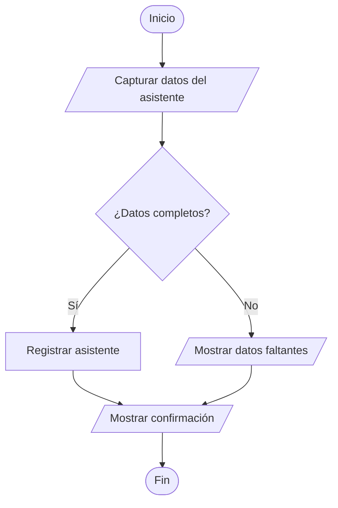

```mermaid 
flowchart TD
    A([Inicio])
    A --> B[/Capturar datos del asistente/]
    B --> C{¿Datos completos?}

    C -->|Sí| D[Registrar asistente]
    D --> E[/Mostrar confirmación/]

    C -->|No| F[/Mostrar datos faltantes/]
    F --> E

    E --> G([Fin]) 
```